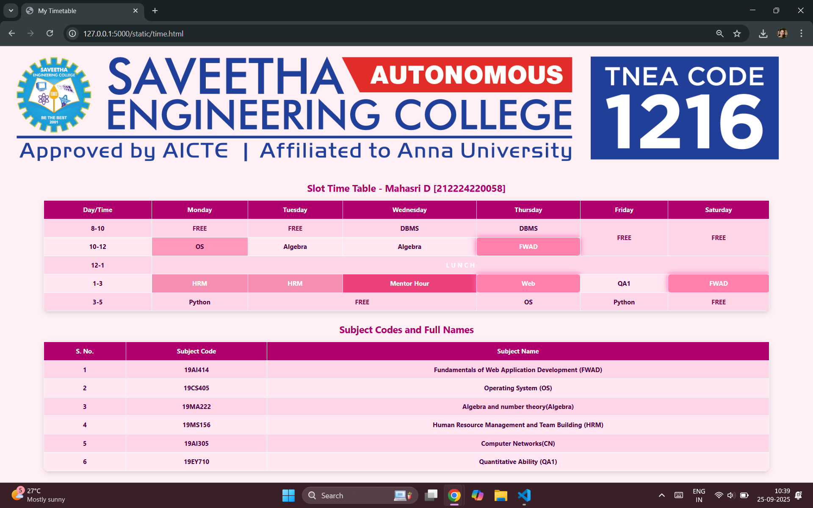

# Ex03 Time Table
## Date:25.09.2025

## AIM
To write a html webpage page to display your slot timetable.

## ALGORITHM
### STEP 1
Create a Django-admin Interface.

### STEP 2
Create a static folder and inert HTML code.

### STEP 3
Create a simple table using ```<table>``` tag in html.

### STEP 4
Add header row using ```<th>``` tag.

### STEP 5
Add your timetable using ```<td>``` tag.

### STEP 6
Execute the program using runserver command.

## PROGRAM
```
<!DOCTYPE html>
<html lang="en">
<head>
  <meta charset="UTF-8">
  <title>My Timetable</title>
  <style>
    body {
      font-family: "Segoe UI", sans-serif;
      background: #fff0f6; /* soft pink background */
      color: #4a003f;
    }
    table {
      border-collapse: collapse;
      margin: 30px auto;
      text-align: center;
      font-weight: bold;
      width: 90%;
      box-shadow: 0 4px 12px rgba(0,0,0,0.15);
      border-radius: 12px;
      overflow: hidden;
    }
    caption {
      caption-side: top;
      margin-bottom: 15px;
      font-size: 24px;
      font-weight: bold;
      color: #b0006d;
    }
    th, td {
      border: 2px solid #fff;
      padding: 12px 15px;
    }
    th {
      background-color: #b0006d;
      color: #fff;
    }
    td {
      background-color: #ffe6f0;
      color: #4a003f;
    }
    tr:nth-child(even) td {
      background-color: #ffd6e8;
    }

    /* Subject color themes in pink shades */
    .lunch {
      background: #ff4d94;
      color: #fff;
      font-weight: bold;
    }
    .free {
      background: #f8bbd0;
      color: #880e4f;
      font-weight: bold;
    }
    .web {
      background: #ff80ab;
      color: #fff;
      font-weight: bold;
      box-shadow: 0 0 12px 3px rgba(255,105,180,0.8); /* glowing highlight */
      border-radius: 8px;
      transition: transform 0.3s ease, box-shadow 0.3s ease;
    }
    .web:hover {
      transform: scale(1.05);
      box-shadow: 0 0 20px 6px rgba(255,20,147,0.9);
    }
    .python {
      background: #ffb3c6;
    }
    .os {
      background: #ff99bb;
    }
    .stats {
      background: #ffccd5;
    }
    .hrm {
      background: #f48fb1;
      color: #fff;
    }
    .mentor {
      background: #ec407a;
      color: #fff;
    }
    .ra {
      background: #ff8fa3;
      color: #fff;
    }

    .logo {
      text-align: center;
      margin-top: 20px;
    }
    .logo img {
      width: 120px;
      height: auto;
    }
  </style>
</head>
<body>


   
 </div>

  <!-- Timetable -->
  <table>
    <caption>Slot Time Table - Mahasri D [212224220058]</caption>
    <tr>
      <th>Day/Time</th>
      <th>Monday</th>
      <th>Tuesday</th>
      <th>Wednesday</th>
      <th>Thursday</th>
      <th>Friday</th>
      <th>Saturday</th>
    </tr>
    <tr>
      <td>8-10</td>
      <td class="free">FREE</td>
      <td class="free">FREE</td>
      <td class="DBMS">DBMS</td>
      <td class="DBMS">DBMS</td>
      <td class="free" rowspan="2">FREE</td>
      <td class="free" rowspan="2">FREE</td>
    </tr>
    <tr>
      <td>10-12</td>
      <td class="os">OS</td>
      <td class="Algebra">Algebra</td>
      <td class="Algebra">Algebra</td>
      <td class="web">FWAD</td>
    </tr>
    <tr>
      <td>12-1</td>
      <td colspan="6" class="lunch">L U N C H</td>
    </tr>
    <tr>
      <td>1-3</td>
      <td class="hrm">HRM</td>
      <td class="hrm">HRM</td>
      <td class="mentor">Mentor Hour</td>
      <td class="web">Web</td>
      <td class="QA1">QA1</td>
      <td class="web">FWAD</td>
    </tr>
    <tr>
      <td>3-5</td>
      <td class="python">Python</td>
      <td class="free" colspan="2">FREE</td>
      <td class="os">OS</td>
      <td class="python">Python</td>
      <td class="free">FREE</td>
    </tr>
  </table>

  <!-- Subject Code Table -->
  <table>
    <caption>Subject Codes and Full Names</caption>
    <tr>
      <th>S. No.</th>
      <th>Subject Code</th>
      <th>Subject Name</th>
    </tr>
    <tr>
      <td>1</td>
      <td>19AI414</td>
      <td>Fundamentals of Web Application Development (FWAD)</td>
    </tr>
    <tr>
      <td>2</td>
      <td>19CS405</td>
      <td>Operating System (OS)</td>
    </tr>
    <tr>
      <td>3</td>
      <td>19MA222</td>
      <td>Algebra and number theory(Algebra)</td>
    </tr>
    <tr>
      <td>4</td>
      <td>19MS156</td>
      <td>Human Resource Management and Team Building (HRM)</td>
    </tr>
    <tr>
      <td>5</td>
      <td>19AI305</td>
      <td>Computer Networks(CN)</td>
    </tr>
    <tr>
      <td>6</td>
      <td>19EY710</td>
      <td>Quantitative Ability  (QA1)</td>
    </tr>
  </table>

</body>
</html>
```

## OUTPUT


## RESULT
The program for creating slot timetable using basic HTML tags is executed successfully.
